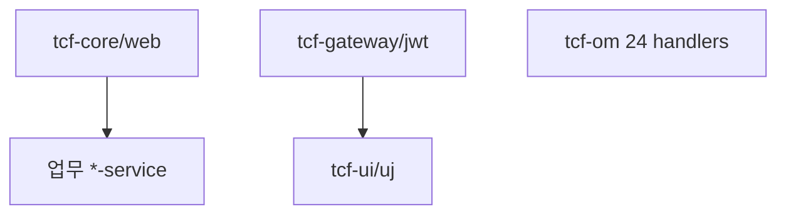

# 부록 N. 소스 어디 있나

| **부록** | N |
| **상태** | 집필 완료 |
| **원본** | [ztcfbook 부록 N](../ztcfbook/부록/N-소스-인덱스.md) |

---

## 그림으로 보기



---

## 거래 1번의 길 (코드 순서)

```text
POST /sv/online
  → OnlineTransactionController     (tcf-web)
  → TCF.process()
       STF → Dispatcher → Handler   (tcf-core + sv-service)
       → Facade → Service → DAO → Mapper.xml
       ETF → JSON 응답 + 거래로그
```

**Handler는 업무 WAR**, **STF·TCF·ETF는 tcf-core**에 있습니다.

---

## 꼭 찾아볼 클래스

| 역할 | 클래스 | 경로 |
| --- | --- | --- |
| HTTP 진입 | `OnlineTransactionController` | `tcf-web/.../entry/web/` |
| 엔진 | `TCF`, `STF`, `ETF` | `tcf-core/.../support/processor/` |
| 라우팅 | `TransactionDispatcher` | `tcf-core/.../support/dispatch/` |
| Handler 규약 | `TransactionHandler` | `tcf-core/.../support/transaction/` |
| 표준 전문 | `StandardRequest`, `StandardHeader` | `tcf-core/.../support/message/` |
| 오류 | `BusinessException`, `ErrorCode` | `tcf-core/.../support/error/` |

---

## 업무 WAR — Handler 위치

모든 업무 WAR는 **같은 패턴**입니다.

```text
{모듈}/src/main/java/com/nh/nsight/marketing/{bc}/entry/handler/
  예: sv-service/.../marketing/sv/entry/handler/SvCustomerHandler.java
```

| BC | 모듈 | 실습용 Handler |
| --- | --- | --- |
| SV | sv-service | `SvCustomerHandler` |
| IC | ic-service | `IcCustomerHandler` |
| OM | tcf-om | `OmServiceCatalogHandler`, `OmAuthHandler` |

6계층 나머지:

| 계층 | 패키지 |
| --- | --- |
| Facade | `.../application/facade/` |
| Service | `.../application/service/` |
| Rule | `.../application/rule/` |
| DAO | `.../persistence/dao/` |
| Mapper XML | `src/main/resources/mapper/{bc}/` |

---

## 플랫폼 모듈 (자주 검색)

| 모듈 | 포트(로컬) | 하는 일 |
| --- | --- | --- |
| tcf-om | 8097 | OM 24 Handler, Catalog |
| tcf-ui | 8099 | 브라우저 Relay, 샘플 JSON |
| tcf-uj | 8102 | Gateway 경유 UI |
| tcf-gateway | 8100 | `/gw/{BC}/online` 프록시 |
| tcf-jwt | 8110 | JWT, JWKS |
| tcf-eai | — | WAR 간 HTTP 연동 |
| tcf-batch | — | 스케줄러 → OM Dashboard |

Gateway 프록시 예: `tcf-gateway/.../entry/web/SvProxyController.java`

---

## 설정·샘플 파일

| 찾을 것 | 경로 |
| --- | --- |
| SV curl JSON | `tcf-ui/src/main/resources/sample-requests/sv-sample-inquiry.json` |
| application.yml | `sv-service/src/main/resources/application.yml` |
| OM DDL | `tcf-om/src/main/resources/schema.sql` |
| Gateway 라우트표 | `tcf-gateway/docs/ROUTING_TABLE.md` |

---

## IDE에서 빠르게

1. **ServiceId**로 `grep` → Handler `serviceIds()` 또는 switch
2. **Mapper 메서드명**으로 `grep` → XML `id="..."`
3. **ErrorCode** 상수 → `ErrorCode.java`
4. 전체 목록 → [docs/SOURCE_INDEX.md](../../docs/SOURCE_INDEX.md)

---

## ⚠️ 초보자 실수

| 실수 | |
| --- | --- |
| `tcf-core`에 Handler 추가 | Handler는 **업무 WAR**만 |
| Controller 찾음 | 업무 **Controller 없음** — `OnlineTransactionController`만 |
| `com.nh.nsight.tcf`에 Mapper | Mapper는 **`marketing.{bc}`** 패키지 |

---

## 이전 · 다음

| | |
| --- | --- |
| ← 이전 | [부록 M 명명규칙](./M-명명규칙-21주제-한눈에.md) |
| → 다음 | [전체 목차](../00-목차.md) |

---

## 📘 원본

- [ztcfbook/부록/N-소스-인덱스.md](../ztcfbook/부록/N-소스-인덱스.md)
- [docs/SOURCE_INDEX.md](../../docs/SOURCE_INDEX.md)
