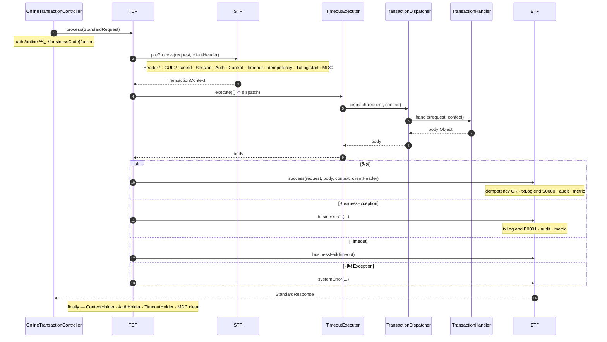
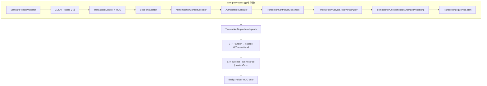

# 제3장. 요청이 지나가는 길

| 항목 | 내용 |
| --- | --- |
| **편** | 제1편 |
| **장** | 제3장 |
| **상태** | 집필 완료 |
| **원본** | [ztcfbook 제3장](../ztcfbook/제01편/03-TCF-처리-엔진.md) |

---

## 그림으로 보기



### STF 내부 · ETF 합류



---

## 3.1 한 줄 요약

```text
JSON 들어옴 → STF(앞처리) → Dispatcher(연결) → Handler(여러분 코드) → ETF(뒤처리) → JSON 나감
```

Controller(`OnlineTransactionController`)가 JSON을 받으면 **`TCF.process()`** 한 번을 호출합니다. 그 안에서 위 순서가 **자동**으로 돕니다.

---

## 3.2 STF — “들어온 요청 검사하기”

**STF(Standard Transaction Framework)** 는 **전처리**입니다. 업무 로직 **전에** 공통으로 합니다.

| 하는 일 | 쉬운 말 |
| --- | --- |
| JSON·Header 형식 검사 | 깨진 요청 거르기 |
| businessCode vs URL 일치 | `/sv/online`인데 header가 `OM`이면 오류 |
| serviceId 필수 | “어떤 기능?” 없으면 실행 불가 |
| GUID·TraceId | 나중에 **로그로 찾을 번호** 붙이기 |
| 세션·권한·거래통제 | “이 사람 이 기능 해도 되나?” |
| 거래 시작 로그 | “지금 처리 중” 기록 |

**여러분이 STF를 직접 호출하지 않습니다.** 설정·Catalog만 맞으면 자동입니다.

---

## 3.3 Dispatcher — “serviceId로 Handler 찾기”

**Dispatcher**는 **전화 교환원**입니다.

1. 서버 **켜질 때** 모든 `TransactionHandler`를 스캔
2. `serviceId` → Handler **맵** 만들기
3. 요청 올 때마다 header의 **serviceId**로 Handler 하나 고르기
4. 그 Handler의 **`doHandle`** 실행

같은 serviceId가 **두 Handler**에 있으면 서버가 **기동 실패**합니다. (중복 등록 방지)

---

## 3.4 Handler — “여기서부터 여러분 코드”

Handler는 **얇게** 유지합니다.

```java
// 개념만 — 실제 코드는 10장·실습에서
public Object doHandle(StandardRequest req, TransactionContext ctx) {
    return customerFacade.selectSummary(req);  // Facade만 호출
}
```

---

## 3.5 ETF — “응답·로그 마무리”

**ETF(End Transaction Framework)** 는 **후처리**입니다.

| 하는 일 |
| --- |
| 성공/실패 **result** 블록 만들기 |
| 오류를 **표준 errorCode**로 바꾸기 |
| **거래로그**에 SUCCESS/FAIL 남기기 |
| 필요 시 **감사로그** |

Handler가 `return`한 값을 ETF가 **StandardResponse** JSON으로 감쌉니다.

---

## 3.6 serviceId는 어디서 오나요?

**클라이언트(JSON header)** 가 보냅니다. URL이 `/sv/online` 하나여도, header에

```json
"serviceId": "SV.Customer.selectSummary"
```

처럼 적으면 Dispatcher가 **고객 요약 Handler**로 연결합니다.

---

## 3.7 ⚠️ 초보자 실수

| 실수 | 결과 |
| --- | --- |
| STF 검사 빼고 Handler만 테스트 | 운영과 **다르게** 동작 |
| serviceId 오타 | “Handler 없음” 오류 |
| Handler에서 `ResponseEntity` 직접 반환 | ETF와 **형식 불일치** |

---

## 요약

- **STF** = 검사·권한·로그 시작  
- **Dispatcher** = serviceId → Handler  
- **Handler** = Facade 호출 (업무 시작)  
- **ETF** = 표준 JSON 응답·로그 끝  

---

## 이전 · 다음

| | |
| --- | --- |
| ← 이전 | [2장 시스템 그림 한 장](./02-시스템-그림-한-장.md) |
| → 다음 | [4장 6계층, 역할만 기억하기](./04-6계층-역할만-기억하기.md) |

---

## 📘 원본에서 더 보기

- [ztcfbook/제01편/03-TCF-처리-엔진.md](../ztcfbook/제01편/03-TCF-처리-엔진.md)
- [ztcfbook/부록/D-표준-전문-JSON-예시.md](../ztcfbook/부록/D-표준-전문-JSON-예시.md)
