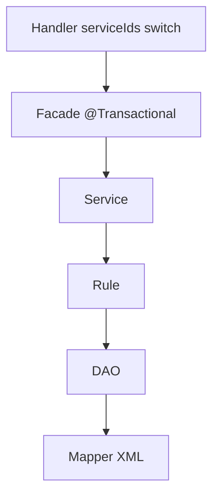

# 제4장. 6계층, 역할만 기억하기

| 항목 | 내용 |
| --- | --- |
| **편** | 제1편 |
| **장** | 제4장 |
| **상태** | 집필 완료 |
| **원본** | [ztcfbook 제4장](../ztcfbook/제01편/04-애플리케이션-6계층.md) |

---

## 그림으로 보기



---

## 4.1 왜 계층을 나누나요?

한 클래스에 **전부** 넣으면 처음은 빠르지만, 나중에 **테스트·수정·코드 리뷰**가 어렵습니다. NSIGHT는 업무 코드를 **6개 층**으로 나눕니다. 각 층은 **한 가지 일**만 합니다.

**비유:** 식당에서 **웨iter(Handler)** 는 주문만 받고, **주방장(Facade)** 이 메뉴 순서를 정하고, **조리(Service·Rule)** · **창고(DAO·Mapper)** 가 나뉩니다.

---

## 4.2 6계층 — 이름과 한 줄 역할

```text
Handler → Facade → Service → Rule → DAO → Mapper
   ↑                                              ↓
   └──────────── TCF가 Handler만 호출 ────────────┘
```

| 계층 | 클래스 이름 예 | 하는 일 (한 줄) |
| --- | --- | --- |
| **Handler** | `SvCustomerHandler` | serviceId 받아 **Facade만** 호출 |
| **Facade** | `SvCustomerFacade` | 한 거래 **흐름 조립**, **트랜잭션** 시작/끝 |
| **Service** | `SvCustomerService` | 업무 **순서** (조회 → 가공 → 반환) |
| **Rule** | `SvCustomerRule` | **검증·계산·업무 규칙** (“고객번호 필수” 등) |
| **DAO** | `SvCustomerDao` | **Mapper 호출**, DB 예외 처리 |
| **Mapper** | `SvCustomerMapper` + XML | **SQL 실행** |

---

## 4.3 각 층에서 하면 안 되는 일

| 계층 | ❌ 하지 말 것 |
| --- | --- |
| Handler | SQL, `@Transactional`, 긴 for문 |
| Facade | SQL 직접 작성 |
| Service | HTTP·세션 다루기 |
| Rule | DB 연결 |
| DAO | 업무 if문 가득 |
| Mapper(Java) | SQL 문자열 (SQL은 **XML**) |

코드 리뷰에서 위반하면 **반려**되는 경우가 많습니다.

---

## 4.4 파일은 어디에 두나요? (sv-service 예)

```text
com.nh.nsight.marketing.sv
├── entry.handler      ← Handler
├── facade             ← Facade
├── service            ← Service
├── rule               ← Rule
├── persistence.dao    ← DAO
└── persistence.mapper ← Mapper 인터페이스

resources/mapper/sv/   ← Mapper XML (SQL)
```

업무코드 **SV** → 패키지 `...marketing.sv`, XML 폴더 `mapper/sv/`.

---

## 4.5 조회 거래 — 데이터가 흐르는 예

**“고객 요약 조회”** 한 번 상상해 보세요.

1. **Handler** — `selectSummary` serviceId → Facade 호출  
2. **Facade** — 트랜잭션 열고 Service 호출  
3. **Service** — Rule로 입력 검사 → DAO 호출  
4. **Rule** — `customerNo` 비었는지 확인  
5. **DAO** — Mapper의 `selectCustomerSummary` 호출  
6. **Mapper/XML** — `SELECT ... FROM ... WHERE customer_no = ?`  
7. 결과가 **거꾸로** 올라와 Map/DTO로 반환 → ETF가 JSON 응답

---

## 4.6 ⚠️ 초보자 실수

| 실수 | 대신 |
| --- | --- |
| Service 없이 Facade에 SQL | Service·Rule·DAO 분리 |
| Rule 생략하고 Service에 if만 | Rule 클래스로 검증 모음 |
| Mapper XML 없이 `@Query` 남발 | 팀 표준은 **MyBatis XML** |

---

## 요약

- **Handler → Facade → Service → Rule → DAO → Mapper** 순서를 외우세요.
- **Handler는 얇게**, **SQL은 Mapper XML**, **검증은 Rule**.
- 패키지·폴더 이름은 **업무코드(sv, ic…)** 와 맞춥니다.

---

## 이전 · 다음

| | |
| --- | --- |
| ← 이전 | [3장 요청이 지나가는 길](./03-요청이-지나가는-길.md) |
| → 다음 | [5장 개발 표준](../제02편/05-개발-표준-한-줄-로-이어지게.md) |

---

## 📘 원본에서 더 보기

- [ztcfbook/제01편/04-애플리케이션-6계층.md](../ztcfbook/제01편/04-애플리케이션-6계층.md)
- [ztcfbook/제03편/10-TransactionHandler-개발.md](../ztcfbook/제03편/10-TransactionHandler-개발.md)
