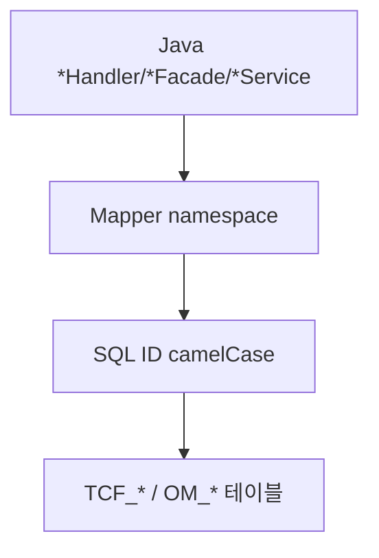

# 제7장. 클래스·패키지 이름 규칙

| 항목 | 내용 |
| --- | --- |
| **편** | 제2편 |
| **상태** | 집필 완료 |
| **원본** | [ztcfbook 제7장](../ztcfbook/제02편/07-코드-DB-명명규칙.md) |

---

## 그림으로 보기



---

## 7.1 패키지 — 업무코드 소문자

SV 업무면:

```text
com.nh.nsight.marketing.sv
├── entry.handler
├── facade
├── service
├── rule
└── persistence.dao / persistence.mapper
```

**IC 업무**면 `...marketing.ic` — **sv와 섞지 않습니다.**

---

## 7.2 클래스 이름 — 역할이 접미사

| 계층 | 패턴 | 예 |
| --- | --- | --- |
| Handler | `Sv` + 도메인 + `Handler` | `SvCustomerHandler` |
| Facade | `Sv` + 도메인 + `Facade` | `SvCustomerFacade` |
| Service | `Sv` + 도메인 + `Service` | `SvCustomerService` |
| Rule | `Sv` + 도메인 + `Rule` | `SvCustomerRule` |
| DAO | `Sv` + 도메인 + `Dao` | `SvCustomerDao` |
| Mapper | `Sv` + 도메인 + `Mapper` | `SvCustomerMapper` |

**Sv** = 업무코드 SV의 PascalCase Prefix.

---

## 7.3 SQL·DB (알아두기만)

| 대상 | 규칙 | 예 |
| --- | --- | --- |
| Mapper XML | `resources/mapper/sv/` | `SvCustomerMapper.xml` |
| SQL ID | XML의 `id` = Java 메서드명 | `selectSummary` |
| 테이블 (운영) | 대문자+언더스코어 | `SV_CUSTOMER` |

SQL은 **Java 문자열에 넣지 않고** XML에 씁니다.

---

## 7.4 ⚠️ 초보자 실수

| 실수 | 대신 |
| --- | --- |
| `CustomerService` (Sv 없음) | `SvCustomerService` |
| Handler를 `controller` 패키지 | `entry.handler` |
| `mapper/common/` 에 SV SQL | `mapper/sv/` |

---

## 요약

- 패키지 = **`...marketing.{업무소문자}`**
- 클래스 = **`Sv` + 이름 + Handler/Facade/…`**
- SQL 파일 = **`mapper/sv/`**

---

## 이전 · 다음

| | |
| --- | --- |
| ← 이전 | [6장 ServiceId·거래코드](./06-ServiceId-거래코드-이름-짓기.md) |
| → 다음 | [8장 새 거래 설계](../제03편/08-새-거래-설계-체크리스트.md) |

---

## 📘 원본에서 더 보기

- [ztcfbook/제02편/07-코드-DB-명명규칙.md](../ztcfbook/제02편/07-코드-DB-명명규칙.md)
- [znsight-man/명명규칙-00-목차.md](../znsight-man/명명규칙-00-목차.md)
