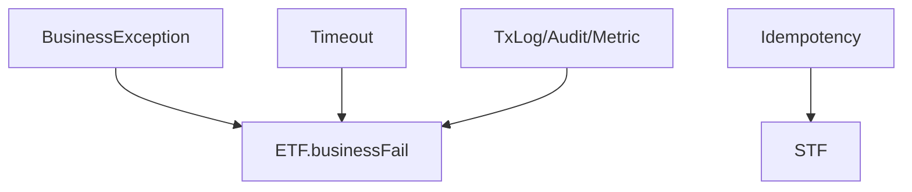

# 제11장. 로그·Timeout·실수 방지

| 항목 | 내용 |
| --- | --- |
| **편** | 제3편 |
| **상태** | 집필 완료 |
| **원본** | [ztcfbook 제11장](../ztcfbook/제03편/11-품질-속성-구현.md) |

---

## 그림으로 보기

---

## 11.1 로그 — 나중에 찾을 번호

장애 나면 **“그 요청 한 건”** 을 찾아야 합니다. TCF가 자동으로 남기는 키:

| 이름 | 쓰임 |
| --- | --- |
| **GUID** | 처음부터 끝까지 한 거래 |
| **TraceId** | 서버 안에서 추적 |
| **serviceId** | 어떤 기능이었는지 |
| **transactionCode** | 로그·통계용 거래 번호 |

개발자는 `System.out.println` 대신 **표준 로거**를 쓰고, **주민번호 전체** 같은 값은 로그에 **남기지 않습니다.**

---

## 11.2 Timeout — “무한 대기” 금지

| 구간 | 보통 |
| --- | --- |
| 온라인 거래 전체 | Catalog에 3~30초 |
| SQL (MyBatis) | XML `timeout="3"` |
| Facade `@Transactional` | readOnly 조회도 초 단위 |

Timeout 나면 **UNKNOWN** 일 수 있습니다. “성공인지 실패인지” **거래로그 GUID**로 다시 확인합니다.

---

## 11.3 품질 — 최소 4가지 테스트

| # | 테스트 |
| --- | --- |
| 1 | 정상 입력 → SUCCESS |
| 2 | 필수값 빠짐 → 검증 오류 |
| 3 | 없는 데이터 → 업무 오류 |
| 4 | 권한 없음 → AUTHZ 오류 |

---

## 11.4 ⚠️ 초보자 실수

| 실수 | |
| --- | --- |
| 로그에 body 전체 출력 | **마스킹** / 필드 제한 |
| Timeout 없음 | Thread **고갈** |
| 테스트 없이 MR | 리뷰 **반려** |

---

## 요약

- **GUID·serviceId·거래코드**로 추적.
- **Timeout**은 거래·SQL·연동에 설정.
- **정상/오류/권한** 테스트 최소 1건씩.

---

## 이전 · 다음

| | |
| --- | --- |
| ← 이전 | [10장 Handler](./10-Handler-만드는-법.md) |
| → 다음 | [19장 로컬 실행](../제06편/19-로컬-PC에서-실행하기.md) |

---

## 📘 원본에서 더 보기

- [ztcfbook/제03편/11-품질-속성-구현.md](../ztcfbook/제03편/11-품질-속성-구현.md)
- [ztcfbook/부록/H-개발-완료-체크리스트.md](../ztcfbook/부록/H-개발-완료-체크리스트.md)
