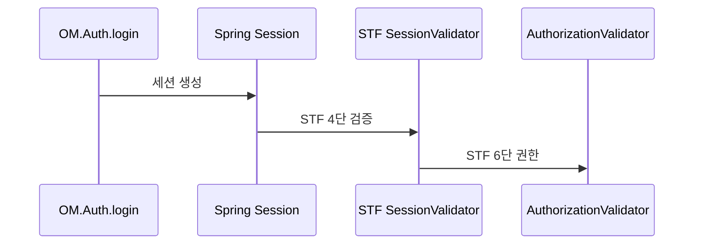

# 제12장. 세션·로그인·권한 (쉽게)

| 항목 | 내용 |
| --- | --- |
| **편** | 제4편 |
| **상태** | 집필 완료 |
| **원본** | [ztcfbook 제12장](../ztcfbook/제04편/12-세션-로그인-권한.md) |

---

## 그림으로 보기



---

## 12.1 세션이란? — “로그인 상태 저장”

**세션**은 “**지금 이 브라우저가 누구로 로그인했는지**”를 서버가 기억하는 방법입니다.

| 비유 | 설명 |
| --- | --- |
| 놀이공원 **손목팔찌** | 입장(로그인) 후 계속 들고 다님 |
| `JSESSIONID` 쿠키 | 손목팔찌 번호 |
| DB `SPRING_SESSION` | 번호 ↔ 사용자 정보 |

NSIGHT에서는 세션 정보를 **WAR 메모리가 아니라 DB(SESSIONDB)** 에 둡니다. 서버를 재시작해도 같은 DB를 보면 로그인이 유지될 수 있습니다.

**주요 모듈:** `tcf-om` (8097) — OM 로그인·관리 화면

---

## 12.2 로그인도 “TCF 거래”다

OM 로그인도 `@PostMapping("/login")` REST가 **아닙니다.**

```text
브라우저 login.html
  → tcf-ui Relay
  → POST /om/online
  → serviceId: OM.Auth.login
```

| serviceId | 하는 일 |
| --- | --- |
| `OM.Auth.login` | 로그인 |
| `OM.Auth.logout` | 로그아웃 |
| `OM.Auth.session` | 지금 로그인됐는지 확인 |

성공하면 **`JSESSIONID` 쿠키**가 브라우저에 붙습니다. 이후 OM·Relay API는 이 쿠키를 같이 보냅니다.

로컬 테스트 계정 예: `admin01` / (팀에서 안내한 비밀번호)

---

## 12.3 tcf-ui는 “쿠키 배달부”

`tcf-ui`(8099)는 **업무 서버가 아닙니다.**

- 브라우저 **Cookie**를 받아서 → `tcf-om`으로 **그대로 전달**
- 응답 **Set-Cookie**를 → 브라우저에 **다시 전달**

그래서 OM Admin은 `http://localhost:8099/om/admin/` 로 열고, 실제 처리는 **8097 tcf-om**에서 합니다.

---

## 12.4 업무 WAR에서 userId

업무 거래(JSON header)에는 **`userId`** 가 들어갑니다.

STF가 (설정에 따라) “userId 없으면 차단” 할 수 있습니다.  
즉 **Gateway/UI가 로그인 확인 후 header에 userId를 실어 보낸다**는 전제가 있습니다.

| 구분 | 역할 |
| --- | --- |
| 세션 | **누가 로그인**했는가 |
| header.userId | **이 거래를 누가** 했는가 (로그·권한) |

---

## 12.5 권한 — 메뉴·기능

OM에는 **권한 그룹**이 있습니다.

| 개념 | 쉬운 말 |
| --- | --- |
| **메뉴** | OM 화면 목록 |
| **기능권한** | “이 사용자 이 버튼/거래 가능?” |
| **데이터권한** | “어느 지점 데이터까지?” |

업무 거래도 **권한 없으면** STF에서 막힐 수 있습니다.  
(권한 **있어도** 거래통제에 없으면 막힐 수 있음 → 14장)

---

## 12.6 ⚠️ 초보자 실수

| 실수 | |
| --- | --- |
| 업무 WAR에 `/login` Controller 추가 | OM·TCF 표준 **우회** |
| header.userId 아무 값 | 권한·로그 **오염** |
| 비밀번호 로그 출력 | **보안 사고** |

---

## 요약

- 로그인 = **`OM.Auth.login`** + **JSESSIONID** 쿠키
- 세션 DB = **SPRING_SESSION** (tcf-om)
- 업무 거래 = header **userId** + 권한 검사

---

## 이전 · 다음

| | |
| --- | --- |
| ← 이전 | [23장 목록·등록](../제08편/23-목록-등록-한-걸음-더.md) |
| → 다음 | [13장 JWT·Gateway](./13-JWT-Gateway-쉽게.md) |

---

## 📘 원본에서 더 보기

- [ztcfbook/제04편/12-세션-로그인-권한.md](../ztcfbook/제04편/12-세션-로그인-권한.md)
