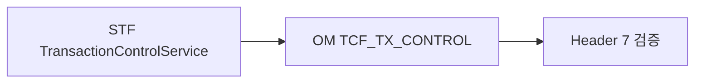

# 제14장. 거래통제 (쉽게)

| 항목 | 내용 |
| --- | --- |
| **편** | 제4편 |
| **상태** | 집필 완료 |
| **원본** | [ztcfbook/제04편/14-거래통제-정책.md](../ztcfbook/제04편/14-거래통제-정책.md) |

---

## 그림으로 보기

---

## 14.1 거래통제 — “이 조합만 허용/차단”

**거래통제**는 Header **7가지**가 맞을 때 “**막을지 말지**” 정하는 OM 정책입니다.

| # | Header 필드 | 예 |
| --- | --- | --- |
| 1 | serviceId | SV.Customer.selectSummary |
| 2 | transactionCode | SV-INQ-0001 |
| 3 | businessCode | SV |
| 4 | serviceName | 고객 요약 조회 |
| 5 | user (userId) | U123456 |
| 6 | channelId | WEBTOP |
| 7 | branch (branchId) | 001234 |

**STF**가 거래 들어올 때 OM DB를 보고 판단합니다.

---

## 14.2 Catalog vs 거래통제

| | Service Catalog | 거래통제 |
| --- | --- | --- |
| 질문 | “이 serviceId **존재**?” | “이 **사람·채널·지점** 조합 OK?” |
| 없으면 | 실행 **불가**(운영) | 기본 **허용**, **BLOCK** Row 있으면 차단 |

신규 거래 오픈 = **Catalog 등록 + (필요 시) 통제 Row** 둘 다.

---

## 14.3 businessCode 정합성

**네 군데가 같아야** 합니다.

| 위치 | SV 예 |
| --- | --- |
| URL | `/sv/online` |
| header.businessCode | `SV` |
| serviceId 시작 | `SV.` |
| Gateway Route | `SV` |

하나만 틀려도 404·Dispatcher 오류·통제 불일치가 납니다.

---

## 14.4 로그인 거래는 예외

`OM.Auth.login`, `logout`, `session` 은 거래통제 검사에서 **빼** 둡니다. (로그인 전에는 userId가 없으니까)

---

## 14.5 ⚠️ 초보자 실수

| 실수 | |
| --- | --- |
| Catalog만 등록 | **통제·Timeout** 빠짐 |
| businessCode만 바꿔 테스트 | serviceId prefix **안 맞음** |
| Gateway 401 vs STF CTL-001 혼동 | **원인 다름** — GUID로 로그 비교 |

---

## 요약

- 거래통제 = Header **7항** 기준
- Catalog = serviceId **등록부**
- **SV 거래면 SV로 통일**

---

## 이전 · 다음

| | |
| --- | --- |
| ← 이전 | [13장 JWT·Gateway](./13-JWT-Gateway-쉽게.md) |
| → 다음 | [15장 OM이 하는 일](../제05편/15-OM이-하는-일.md) |

---

## 📘 원본에서 더 보기

- [ztcfbook/제04편/14-거래통제-정책.md](../ztcfbook/제04편/14-거래통제-정책.md)
- [ztcfbook/부록/H-개발-완료-체크리스트.md](../ztcfbook/부록/H-개발-완료-체크리스트.md)
