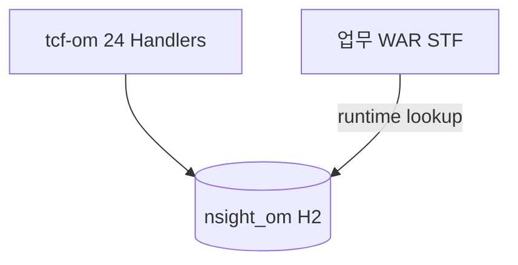

# 제15장. OM이 하는 일

| 항목 | 내용 |
| --- | --- |
| **편** | 제5편 |
| **상태** | 집필 완료 |
| **원본** | [ztcfbook 제15장](../ztcfbook/제05편/15-OM-아키텍처와-개발.md) |

---

## 그림으로 보기



---

## 15.1 OM = “운영 관리 센터”

**OM(Operation Management)** 은 고객·상품 **업무**를 처리하지 않습니다.  
플랫폼 **운영에 필요한 기준 정보**를 관리합니다.

| OM이 하는 일 | 예 |
| --- | --- |
| 사용자·권한·메뉴 | admin01 로그인 |
| **ServiceId Catalog** | 어떤 거래가 등록됐는지 |
| **거래통제·Timeout** | 막을지, 몇 초 기다릴지 |
| 공통코드·오류코드 | 화면·응답 메시지 |
| **거래로그 조회** | GUID로 추적 |
| 배치·대시보드 | AP/DB/세션 상태 |

**모듈:** `tcf-om` · 포트 **8097** · `POST /om/online`

---

## 15.2 tcf-om vs om-service

| | tcf-om | om-service |
| --- | --- | --- |
| 지금 쓰나? | **✅ 표준** | ❌ 레거시(샘플) |
| 배포 | CI/CD 포함 | **안 함** |

신규 개발은 **무조건 tcf-om** 기준.

---

## 15.3 OM도 TCF와 6계층

업무 WAR와 **똑같은 방식**입니다.

```text
POST /om/online
  → OM.Auth.login, OM.ServiceCatalog.inquiry, …
  → OmXxxHandler → Facade → … → DB(OMDB)
```

serviceId 형식: **`OM.{기능}.{행동}`**

| serviceId | 설명 |
| --- | --- |
| `OM.Auth.login` | 로그인 |
| `OM.ServiceCatalog.inquiry` | Catalog 조회 |
| `OM.TransactionControl.save` | 거래통제 저장 |
| `OM.User.inquiry` | 사용자 조회 |

Handler는 **도메인당 1개** + `serviceIds()` 여러 개 (10장과 동일 패턴).

---

## 15.4 신규 serviceId 오픈 — OM에 등록할 것

업무 거래 하나 낼 때 OM 쪽 **최소 3가지**:

| # | 등록 | 테이블(개념) |
| --- | --- | --- |
| 1 | **Service Catalog** | serviceId, Handler, USE_YN |
| 2 | **거래통제** (필요 시) | 7항 + BLOCK |
| 3 | **Timeout** | 몇 초 |

로컬은 `data.sql` seed에 이미 있을 수 있음 → **운영은 OM 화면/SQL**.

---

## 15.5 OM Admin 화면

브라우저: `http://localhost:8099/om/admin/` (tcf-ui)

- 로그인 → 메뉴 → ServiceId / 사용자 / 거래로그 …
- JS `om-admin.js`가 **Relay**로 `/om/online` 호출

---

## 15.6 ⚠️ 초보자 실수

| 실수 | |
| --- | --- |
| Catalog 없이 운영 배포 | **실행 차단** |
| om-service 코드 참고 | **tcf-om**만 |
| OM DB를 업무 Mapper에서 JOIN | **계층·DB 분리** 위반 |

---

## 요약

- **OM** = Catalog·통제·권한·로그 **원장**
- **`tcf-om`** + **`OM.*` serviceId**
- 신규 거래 = **Catalog 등록 필수**

---

## 이전 · 다음

| | |
| --- | --- |
| ← 이전 | [14장 거래통제](../제04편/14-거래통제-쉽게.md) |
| → 다음 | [16장 Gateway·UI](./16-Gateway-UI-채널.md) |

---

## 📘 원본에서 더 보기

- [ztcfbook/제05편/15-OM-아키텍처와-개발.md](../ztcfbook/제05편/15-OM-아키텍처와-개발.md)
- [znsight-man/47-ServiceId-등록-절차.md](../znsight-man/47-ServiceId-등록-절차.md)
