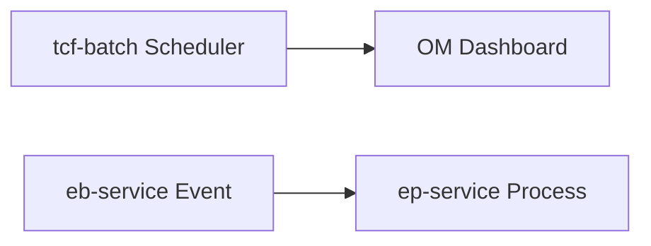

# 제17장. 배치·모니터링

| 항목 | 내용 |
| --- | --- |
| **편** | 제5편 |
| **상태** | 집필 완료 |
| **원본** | [ztcfbook 제17장](../ztcfbook/제05편/17-Batch-Scheduler-이벤트.md) |

---

## 그림으로 보기



---

## 17.1 tcf-batch — “OM 대시보드용 수집기”

**tcf-batch** (8098)는 **정산·마감 같은 업무 배치가 아닙니다.**

주기적으로 **서버 상태 스냅샷**을 모아 OM DB에 넣습니다.

| Job | 수집 내용 | 저장 |
| --- | --- | --- |
| AP 상태 | CPU, Heap, Thread | OM_AP_STATUS |
| DB 상태 | Pool 사용률 | OM_DB_STATUS |
| 세션 | 로그인 세션 수 | OM_SESSION_STATUS |
| 배포 | WAR 버전·기동 | OM_DEPLOY_STATUS |

OM 화면은 **조회만** — 배치가 UI를 그리지 **않습니다**.

---

## 17.2 흐름

```text
tcf-batch (스케줄)
  → 각 WAR Actuator / DB 조회
  → OM_*_STATUS 테이블 UPSERT
  → tcf-om 대시보드에서 OM.Dashboard.* 로 조회
```

---

## 17.3 OM에서 배치 수동 실행

`OM.Batch.execute` 같은 **TCF 거래**로 Job을 **수동 실행**할 수도 있습니다. (관리자)

---

## 17.4 업무 배치와 구분

| | tcf-batch | eb-service Scheduler 등 |
| --- | --- | --- |
| 목적 | **운영 모니터링** | **업무** (이벤트, 정산) |
| 모듈 | tcf-batch | 각 업무 WAR |

업무 `@Scheduled`는 **그 업무 모듈** 책임.

---

## 17.5 ⚠️ 초보자 실수

| 실수 | |
| --- | --- |
| tcf-batch에 고객 정산 넣기 | **모니터링 전용** |
| 배치 안 띄우고 세션 대시보드만 본다 | **8098** 기동 필요 |

---

## 요약

- **tcf-batch** = OM **대시보드 데이터 수집**
- **업무 배치** = 별도 모듈
- OM **Batch** 메뉴 = Job 메타·이력

---

## 이전 · 다음

| | |
| --- | --- |
| ← 이전 | [16장 Gateway·UI](./16-Gateway-UI-채널.md) |
| → 다음 | [18장 DB 종류](./18-DB-종류-한-눈에.md) |

---

## 📘 원본에서 더 보기

- [ztcfbook/제05편/17-Batch-Scheduler-이벤트.md](../ztcfbook/제05편/17-Batch-Scheduler-이벤트.md)
