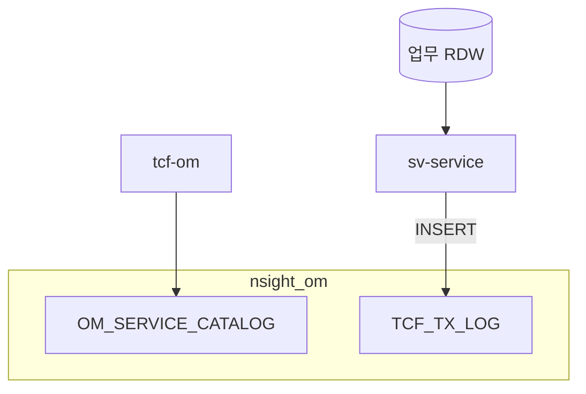

# 제18장. DB 종류 한 눈에

| 항목 | 내용 |
| --- | --- |
| **편** | 제5편 |
| **상태** | 집필 완료 |
| **원본** | [ztcfbook 제18장](../ztcfbook/제05편/18-데이터-DB-아키텍처.md) · [부록 L](../ztcfbook/부록/L-TCF-핵심-테이블-DDL-요약.md) |

---

## 그림으로 보기

---

## 18.1 DB를 나누는 이유

**한 DB에 다 넣지 않습니다.**  
로그 폭주가 조회 SQL을 막지 않게 **역할별로 Pool**을 나눕니다.

---

## 18.2 이름표

| 이름 | 뭐 들어있나 | 로컬(H2) 대략 |
| --- | --- | --- |
| **RDW** | 업무 **조회** SQL | `nsight_sv` 등 (업무 WAR) |
| **OMDB** | 사용자, Catalog, 통제, 코드 | `./data/nsight-txlog/nsight_om` |
| **SESSIONDB** | `SPRING_SESSION` (로그인) | **OM과 같은 파일** often |
| **LOGDB** | **TCF_TX_LOG** (거래로그) | 같은 nsight_om 파일 |
| **Gateway DB** | Route, Gateway 로그 | `./data/gateway-route` |
| **JWT DB** | Refresh, Denylist | tcf-jwt |

---

## 18.3 업무 개발자가 건드리는 DB

| ✅ 해도 됨 | ❌ 하면 안 됨 |
| --- | --- |
| **RDW** (또는 업무 H2) Mapper SQL | OM 사용자 테이블 **직접** UPDATE |
| 거래로그는 **ETF가 INSERT** | 업무 Service에서 **LOG 테이블** 직접 |

Catalog·통제 읽기는 **STF(tcf-core)** 가 OMDB를 **조회**합니다. 업무 코드에서 직접 안 해도 됩니다.

---

## 18.4 거래로그 TCF_TX_LOG

모든 온라인 WAR가 **같은 LOG DB**에 한 줄씩 남깁니다.

| 컬럼 예 | 의미 |
| --- | --- |
| GUID | 거래 추적 ID |
| SERVICE_ID | 실행 기능 |
| TRANSACTION_CODE | 거래코드 |
| RESULT_STATUS | SUCCESS / FAIL |

OM 화면에서 **거래로그 조회** 가능.

---

## 18.5 OM 핵심 테이블 (외울 것 3개)

| 테이블 | 용도 |
| --- | --- |
| `OM_SERVICE_CATALOG` | serviceId **등록부** |
| `TCF_TRANSACTION_CONTROL` | **거래통제** |
| `TCF_TX_LOG` | **거래 이력** |

나머지 20개는 OM Admin·부록 L 참고.

---

## 18.6 ⚠️ 초보자 실수

| 실수 | |
| --- | --- |
| 업무 Mapper에서 OM_USER JOIN | **DB 경계** |
| 로컬 prod DB URL | **local profile** |
| `./data/nsight-txlog` 삭제 | 로그·OM **초기화** |

---

## 요약

- **RDW** = 업무 SQL · **OMDB** = 운영 기준 · **LOG** = 거래로그
- 세션 = **SPRING_SESSION**
- 신규 거래 = **Catalog** (OMDB)

---

## 이전 · 다음

| | |
| --- | --- |
| ← 이전 | [17장 배치](./17-배치-모니터링.md) |
| → 다음 | [부록 H 체크](../부록/H-개발-끝나기-전-체크.md) |

---

## 📘 원본에서 더 보기

- [ztcfbook/제05편/18-데이터-DB-아키텍처.md](../ztcfbook/제05편/18-데이터-DB-아키텍처.md)
- [ztcfbook/부록/L-TCF-핵심-테이블-DDL-요약.md](../ztcfbook/부록/L-TCF-핵심-테이블-DDL-요약.md) · [부록 L (쉬운 버전)](../부록/L-DB-테이블-한눈에.md)
