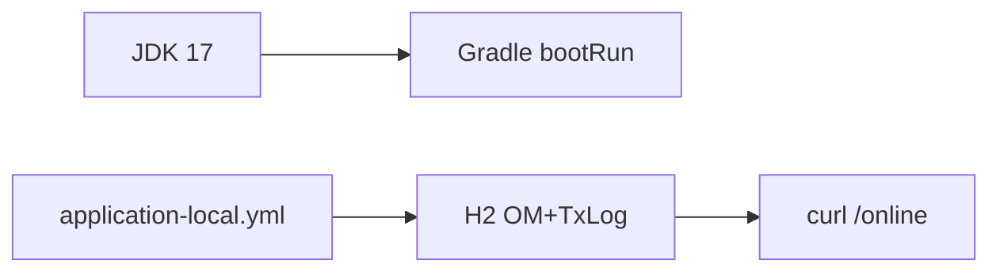

# 제19장. 로컬 PC에서 실행하기

| 항목 | 내용 |
| --- | --- |
| **편** | 제6편 |
| **상태** | 집필 완료 |
| **원본** | [ztcfbook 제19장](../ztcfbook/제06편/19-로컬-개발환경.md) |

---

## 그림으로 보기



---

## 19.1 준비물

| 도구 | 확인 |
| --- | --- |
| JDK 17+ (프로젝트 21) | `java -version` |
| Git | `git --version` |
| Gradle Wrapper | `gradlew -v` (Windows: `gradlew.bat`) |

IDE: IntelliJ 또는 VS Code. **Profile은 local** — 운영(prd) DB·비밀번호 쓰지 마세요.

---

## 19.2 첫 빌드

```bash
cd nsight-tcf-framework
gradlew clean build
```

Windows PowerShell:

```powershell
.\gradlew.bat clean build
```

한 번 **성공**하면 의존성·컴파일은 대체로 OK입니다.

---

## 19.3 sv-service만 띄우기 (실습용)

IntelliJ에서:

1. Gradle → `sv-service` → Tasks → bootRun  
   또는 `SvServiceApplication` Run  
2. 콘솔에 **8086**, Context **/sv** 확인  
3. 브라우저 Health: `http://localhost:8086/sv/actuator/health` (설정에 따라)

**OM·Gateway 없이** SV만으로 22장 실습 가능합니다.

---

## 19.4 자주 쓰는 포트

| 모듈 | 포트 |
| --- | --- |
| sv-service | 8086 |
| tcf-om | 8097 |
| tcf-gateway | 8100 |
| tcf-ui | 8099 |

---

## 19.5 데이터 폴더 (처음 한 번)

로컬 H2 파일 DB:

```text
./data/nsight-txlog/    ← 거래로그·OM
./data/gateway-route/   ← Gateway 쓸 때
```

없으면 기동 시 **만들어지는 경우**가 많습니다. 오류 나면 폴더 **쓰기 권한** 확인.

---

## 19.6 ⚠️ 초보자 실수

| 실수 | |
| --- | --- |
| `mvn spring-boot:run` | 이 프로젝트는 **Gradle** |
| prod profile | local만 |
| 포트 충돌 | 8086 사용 중인지 확인 |

---

## 요약

- `gradlew build` → **sv-service bootRun (8086)**.
- 실습 전 **Health** 한 번 확인.
- 다음: [22장 SV 실습](../제08편/22-SV-고객요약-따라하기.md) · 배포는 [20장](./20-배포-릴리즈-쉽게.md)

---

## 이전 · 다음

| | |
| --- | --- |
| ← 이전 | [11장 로그·Timeout](../제03편/11-로그-Timeout-실수-방지.md) |
| → 다음 | [20장 배포·릴리즈](./20-배포-릴리즈-쉽게.md) |

---

## 📘 원본에서 더 보기

- [ztcfbook/제06편/19-로컬-개발환경.md](../ztcfbook/제06편/19-로컬-개발환경.md)
- [znsight-man/63-로컬-빌드-방법.md](../znsight-man/63-로컬-빌드-방법.md)
