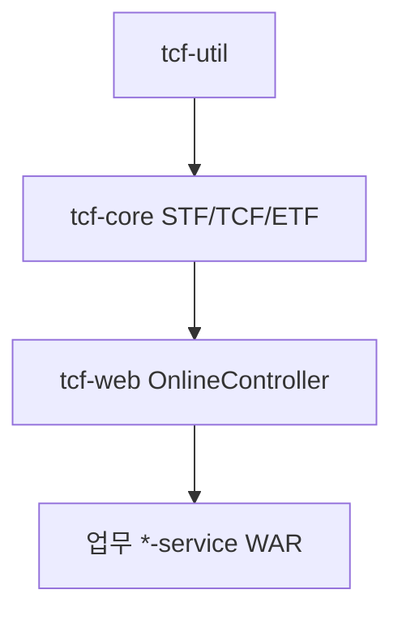

# 제24장. 플랫폼 JAR 3종

| 항목 | 내용 |
| --- | --- |
| **편** | 제9편 |
| **상태** | 집필 완료 |
| **원본** | [ztcfbook 제24장](../ztcfbook/제09편/24-tcf-core-web-util.md) |

---

## 그림으로 보기



---

## 24.1 층 쌓기 — util → core → web

업무 WAR 위에 **3개 JAR**가 깔립니다.

| JAR | 한 줄 |
| --- | --- |
| **tcf-util** | 날짜·문자열 같은 **순수 유틸** |
| **tcf-core** | STF → Handler → ETF **엔진** |
| **tcf-web** | `POST /{bc}/online` **HTTP 입구** |

비유: util=공구, core=엔진, web=문.

---

## 24.2 tcf-core — 요청이 도는 곳

```text
StandardRequest
  → STF (Header·GUID·통제·로그 시작)
  → Dispatcher (serviceId → Handler)
  → Handler (업무 WAR)
  → ETF (응답·로그 끝)
```

업무 개발자가 직접 만드는 건 **`TransactionHandler`** 뿐입니다.

---

## 24.3 tcf-web — Controller 만들지 마세요

| ✅ tcf-web | ❌ 업무 WAR |
| --- | --- |
| `/sv/online` Controller | **Controller 없음** |
| `NsightWarBootstrap.run(...)` | main에서 Bootstrap 호출 |

모든 업무 WAR URL 패턴은 **같습니다**: `POST /{업무코드}/online`

---

## 24.4 5분 Quick Start

```bash
gradle :sv-service:bootRun

curl -X POST http://127.0.0.1:8086/sv/online \
  -H "Content-Type: application/json" \
  -d @tcf-ui/src/main/resources/sample-requests/sv-sample-inquiry.json
```

---

## 24.5 ⚠️ 초보자 실수

| 실수 | |
| --- | --- |
| 업무 WAR에 `@RestController` 추가 | **tcf-web 공통** |
| tcf-util에 업무 Rule 넣기 | **도메인 로직은 WAR** |
| tcf-core 직접 수정 | **프레임워크 팀** 영역 |

---

## 요약

- **util → core → web → *-service**
- Handler만 구현, URL은 **공통 `/online`**

---

## 이전 · 다음

| | |
| --- | --- |
| ← 이전 | [21장 테스트](../제07편/21-테스트-어떻게-하나.md) |
| → 다음 | [25장 OM·UI·uj](./25-OM-UI-uj-모듈.md) |

---

## 📘 원본에서 더 보기

- [ztcfbook/제09편/24-tcf-core-web-util.md](../ztcfbook/제09편/24-tcf-core-web-util.md)
