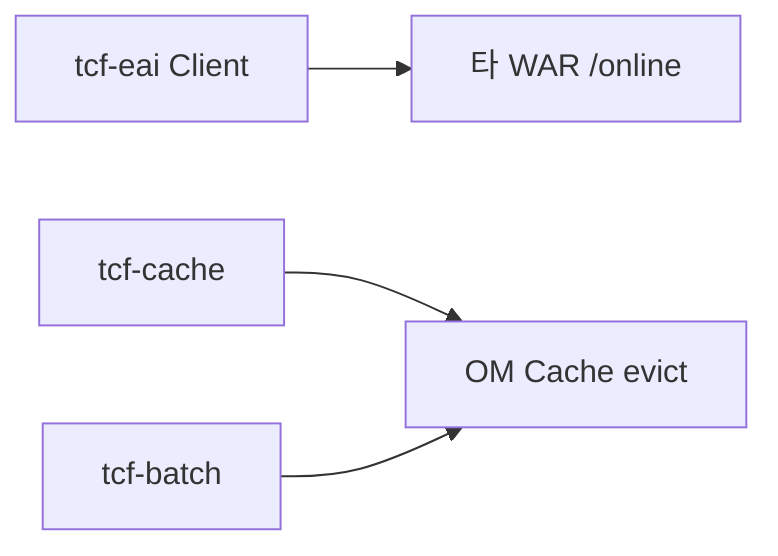

# 제27장. 연동·캐시·배치 모듈

| 항목 | 내용 |
| --- | --- |
| **편** | 제9편 |
| **상태** | 집필 완료 |
| **원본** | [ztcfbook 제27장](../ztcfbook/제09편/27-tcf-eai-cache-batch.md) |

---

## 그림으로 보기



---

## 27.1 tcf-eai — WAR끼리 부를 때

| ❌ 금지 | ✅ 표준 |
| --- | --- |
| sv가 ic **Java import** | **HTTP** `POST /ic/online` |

```java
client.callForBody("IC", "IC.Sample.inquiry", "IC-INQ-0001", body, ctx);
```

**GUID·userId** 같은 Header는 **그대로 전파**됩니다.

---

## 27.2 tcf-cache — 공통코드·Catalog 캐시

| 캐시 | TTL 대략 |
| --- | --- |
| commonCode | 30분 |
| serviceCatalog | 60분 |

OM에서 코드 바꾸면 **`OM.Cache.*`** 로 Evict.

---

## 27.3 tcf-batch — 대시보드 수집 (8098)

17장과 같습니다. **고객 정산 배치가 아님.**

```bash
gradle :tcf-batch:bootRun
curl http://localhost:8098/actuator/health
```

---

## 27.4 ⚠️ 초보자 실수

| 실수 | |
| --- | --- |
| WAR 간 `@Autowired` | **tcf-eai** |
| 캐시만 믿고 OM 등록 생략 | **Catalog SoT = OMDB** |
| tcf-batch에 업무 Job | **각 *-service** |

---

## 요약

- **eai** = WAR 간 HTTP
- **cache** = OM 기준정보 속도
- **batch** = OM 모니터링 데이터

---

## 이전 · 다음

| | |
| --- | --- |
| ← 이전 | [26장 Gateway·JWT](./26-Gateway-JWT-모듈.md) |
| → 다음 | [28장 CI/CD·스크립트](./28-CICD-스크립트.md) |

---

## 📘 원본에서 더 보기

- [ztcfbook/제09편/27-tcf-eai-cache-batch.md](../ztcfbook/제09편/27-tcf-eai-cache-batch.md)
