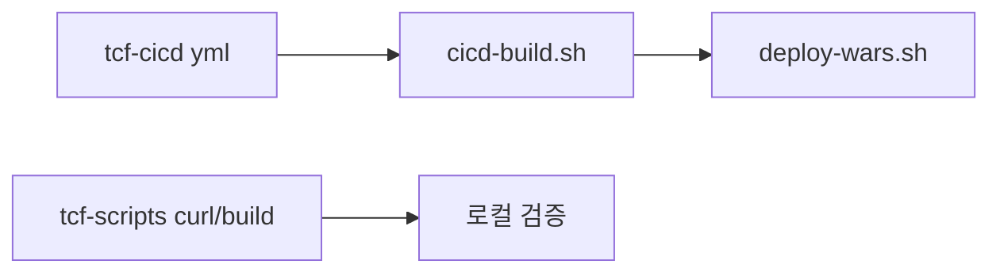

# 제28장. CI/CD·스크립트

| 항목 | 내용 |
| --- | --- |
| **편** | 제9편 |
| **상태** | 집필 완료 |
| **원본** | [ztcfbook 제28장](../ztcfbook/제09편/28-tcf-cicd-scripts.md) · [ztcfbook 제20장](../ztcfbook/제06편/20-CICD-릴리즈-DR.md) |

---

## 그림으로 보기



---

## 28.1 tcf-cicd — 설정 파일 창고

**실행 WAR가 아닙니다.**  
`local` / `dev` / `prod` **yml·Tomcat·Apache** 설정의 **단일 원본(SoT)**.

```text
tcf-cicd/
├── local/ dev/ prod/
│   └── spring/{모듈}/application-{profile}.yml
└── scripts/
    ├── sync-to-framework.ps1
    └── cicd-deploy.ps1
```

설정 바꿀 때: **tcf-cicd 수정 → sync → framework**

---

## 28.2 tcf-scripts — 로컬 기동 단축

| 스크립트 | 용도 |
| --- | --- |
| `run-local.bat sv` | SV bootRun |
| `run-all-local.bat` | 주요 WAR 한꺼번에 |
| `build-war.bat sv` | WAR 빌드 |

19장 `gradlew bootRun`과 **같은 일**, 클릭 한 번 버전.

---

## 28.3 ztomcat — Tomcat에 WAR 올리기

bootRun = 개발 PC용.  
**Tomcat 배포**가 운영에 가깝습니다.

```text
bootWar → deploy-wars.bat → start.bat → http://localhost:8080/sv/online
```

---

## 28.4 Pipeline 한 줄

```text
Push → Build → Test → Sonar → bootWar → Deploy → Smoke → Health
```

실패하면 **배포 중단**이 원칙.

---

## 28.5 ⚠️ 초보자 실수

| 실수 | |
| --- | --- |
| 각 WAR yml만 따로 수정 | **tcf-cicd SoT** 깨짐 |
| prod Secret을 yml에 평문 | **환경 변수·Vault** |
| Smoke 없이 배포 | **대표 serviceId curl** 필수 |

---

## 요약

- **tcf-cicd** = 환경 설정 원본
- **tcf-scripts** = 로컬 편의
- **ztomcat** = Tomcat 검증
- 자세한 배포·롤백 → [20장](../제06편/20-배포-릴리즈-쉽게.md)

---

## 이전 · 다음

| | |
| --- | --- |
| ← 이전 | [27장 연동·캐시·배치](./27-연동-캐시-배치-모듈.md) |
| → 다음 | [29장 업무 WAR 5종](./29-업무-WAR-5종.md) |

---

## 📘 원본에서 더 보기

- [ztcfbook/제09편/28-tcf-cicd-scripts.md](../ztcfbook/제09편/28-tcf-cicd-scripts.md)
- [ztcfbook/제06편/20-CICD-릴리즈-DR.md](../ztcfbook/제06편/20-CICD-릴리즈-DR.md)
