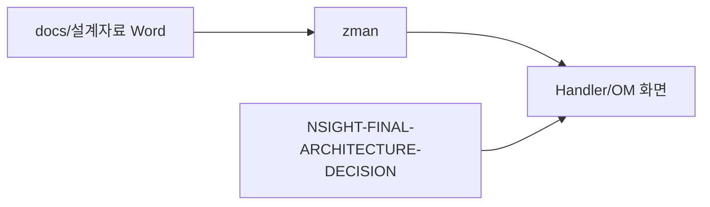

# 제31장. 설계안 어디 보나

| 항목 | 내용 |
| --- | --- |
| **편** | 제10편 |
| **상태** | 집필 완료 |
| **원본** | [ztcfbook 제31장](../ztcfbook/제10편/31-공식-설계안-매핑.md) |

---

## 그림으로 보기



---

## 31.1 문서가 여러 층 — 헷갈리지 않기

```text
Word 설계안 (docs/설계자료/)
    ↓ 요약
docs/architecture/
    ↓ 실무
znsight-man/ (매뉴얼)
    ↓ Quick Start
zguide/ (모듈 가이드)
    ↓ 입문
ztcfbook-m/ (지금 읽는 책)
```

**초보:** ztcfbook-m → 막히면 ztcfbook → 세부는 znsight-man.

---

## 31.2 설계안 → OM 화면

운영 설정은 대부분 **OM Admin**에 있습니다.

| OM 메뉴 | 뭘 관리? |
| --- | --- |
| service-catalog | **serviceId 등록** |
| transaction-control | **거래통제** |
| timeout-policy | **Timeout** |
| transaction-log | **거래로그 조회** |
| user-auth | 사용자·권한 |
| common-code | 공통코드 |

15장 OM + **설계 근거** 연결표.

---

## 31.3 설계안 → 코드 예 (거래통제)

```text
설계: Header 7항 Allow-List
  → tcf-core: TransactionControlService
  → tcf-om: OM.TransactionControl.*
  → 업무 WAR: (직접 안 함 — STF가 검사)
```

**업무 개발자**는 Catalog·통제 **등록**만 신경 쓰면 됩니다.

---

## 31.4 ⚠️ 초보자 실수

| 실수 | |
| --- | --- |
| Word만 보고 코드 위치 모름 | **ztcfbook 31장·architecture** |
| OM 화면 없이 yml만 수정 | **SoT = OMDB** |
| zguide와 ztcfbook-m 혼동 | **m=입문, book=전체** |

---

## 요약

- 공식 설계 = **docs/설계자료/**
- 운영 반영 = **OM Admin**
- 코드 = **tcf-core·tcf-om·업무 Handler**

---

## 이전 · 다음

| | |
| --- | --- |
| ← 이전 | [30장 업무 WAR 4종](../제09편/30-업무-WAR-4종.md) |
| → 다음 | [32장 아직 부족한 것](./32-아직-부족한-것.md) |

---

## 📘 원본에서 더 보기

- [ztcfbook/제10편/31-공식-설계안-매핑.md](../ztcfbook/제10편/31-공식-설계안-매핑.md)
