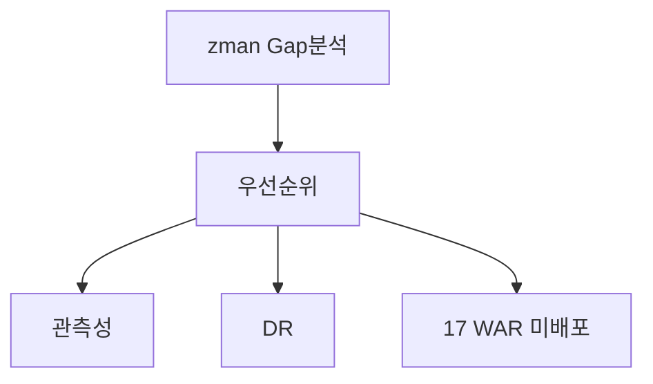

# 제32장. 아직 부족한 것 (Gap)

| 항목 | 내용 |
| --- | --- |
| **편** | 제10편 |
| **상태** | 집필 완료 |
| **원본** | [ztcfbook 제32장](../ztcfbook/제10편/32-Gap-보완-향후-과제.md) |

---

## 그림으로 보기

---

## 32.1 한 줄 결론

**프레임워크 뼈대는 있다.**  
**실제 은행 운영**까지는 아직 **보강할 게 남아 있다**.

| ✅ 이미 있음 | 🔧 더 필요 |
| --- | --- |
| STF·Handler·OM·Gateway | **운영 프로세스** 검증 |
| 9개 업무 WAR 샘플 | **17 WAR** 확장 |
| tcf-eai·JWT·batch | CI/CD·Sonar **완성** |
| ztcfbook 문서 | IdP SSO·Vault Secret |

---

## 32.2 우선순위 (외울 것 3단)

| 등급 | 의미 | 예 |
| --- | --- | --- |
| **P1** | 운영 **전** 필수 | JWT·세션, Catalog 실등록, CI/CD |
| **P2** | 운영 **안정** | Gateway Route DB, Slow Query |
| **P3** | **확장** | WAR 17개, Handler 템플릿 |

---

## 32.3 초보 개발자에게 의미

| | |
| --- | --- |
| 지금 배운 패턴 | **표준이 맞음** — Handler·6계층·Catalog |
| prod 바로 배포 | **아직** — P1 과제·운영 체크리스트 먼저 |
| om-service | **쓰지 말 것** — tcf-om |

---

## 32.4 ⚠️ 초보자 실수

| 실수 | |
| --- | --- |
| “샘플 = 운영 완성” 착각 | **Gap 목록** 확인 |
| 프레임워크 우회 패치 | **P1 보안** 깨짐 |
| 문서 없이 운영 반영 | **부록 J** (ztcfbook) |

---

## 요약

- **코드 골격 O**, **운영 성숙도 △**
- **P1** = 보안·Catalog·CI/CD
- 입문서 끝 → 심화는 **ztcfbook 전체·부록 I~N**

---

## 이전 · 다음

| | |
| --- | --- |
| ← 이전 | [31장 설계안](./31-설계안-어디-보나.md) |
| → 다음 | [부록 G yml](../부록/G-application-yml-기본.md) |

---

## 📘 원본에서 더 보기

- [ztcfbook/제10편/32-Gap-보완-향후-과제.md](../ztcfbook/제10편/32-Gap-보완-향후-과제.md)
- [ztcfbook/부록/J-운영-전환-체크리스트.md](../ztcfbook/부록/J-운영-전환-체크리스트.md)
